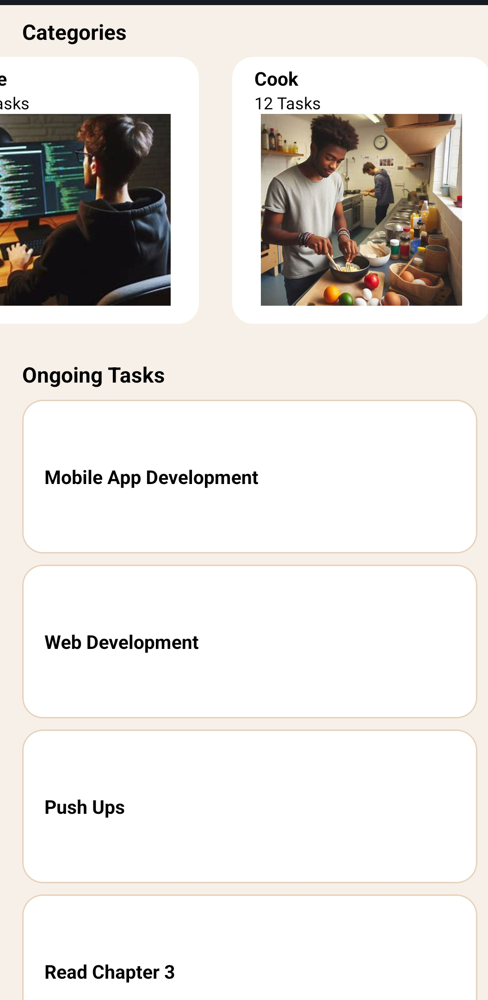
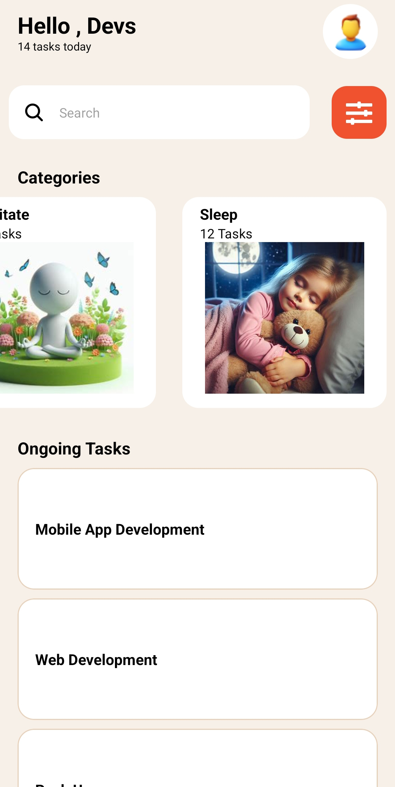

/\*\*

- This repository contains the code for Assignment 3 of the Mobile App Development Course. The assignment involves recreating a UI design provided in the UI mockup, utilizing various core components of React Native, and implementing custom components for enhanced functionality.
-
- @author 11357610
- @version 1.0
- @since 2023-04-01
  \*/

# rn-assignment3-11357610

This repository contains the code for Assignment 3 of the Mobile App Development Course. The assignment involves recreating a UI design provided in the UI mockup, utilizing various core components of React Native, and implementing custom components for enhanced functionality.

## Student ID

11357610

### Core Components Used:

- View: Container for other components
- Text: Displaying text content
- ScrollView: Scrolling container for content
- TextInput: Input field for user interaction
- Stylesheet: Styling components with CSS-like styles
- Button: Interactive button for user actions
- FlatList or SectionList: Rendering lists of tasks
- Image: Displaying icons and images

### Requirements:

- Recreate the provided design in the UI mockup.
- Utilize all core components listed above.
- Include at least eight categories such as Exercise, Study, Code, Cook, etc.
- Provide a list of 15 ongoing tasks.
- Style the application to closely match the provided UI design.
- Use custom components throughout the application.

### Instructions:

1. Clone this repository to your local machine.
2. Commit each task separately to track progress effectively.
3. Access the UI Design [here](provided_UI_design.png) (link to UI Design).
4. Download resources for the application from the Figma file [here](#) (link to Figma file).
5. Write a README file that includes a brief description of each component's usage and screenshots of the app.

### Usage:

To get started with the project:

1. Clone this repository: `git clone https://github.com/blip-cmd/rn-assignment3-11357610.git`
2. Install dependencies: `npm install`
3. Run the application: `npm start`

### Screenshots:

---

Hit Me Up and let's build...BuildOurNation!
