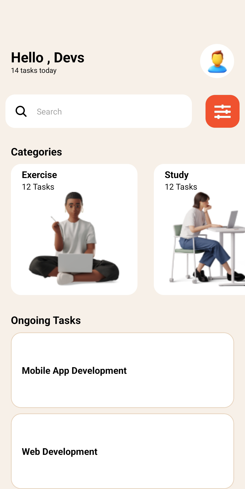

# rn-assignment3-11357610

This repository contains the code for Assignment 3 of the Mobile App Development Course. The assignment involves recreating a UI design provided in the UI mockup, utilizing various core components of React Native, and implementing custom components for enhanced functionality.

## Student ID

11357610

### Core Components Used:

- View: Container for other components
- Text: Displaying text content
- ScrollView: Scrolling container for content
- TextInput: Input field for user interaction
- Stylesheet: Styling components with CSS-like styles
- Button: Interactive button for user actions
- FlatList or SectionList: Rendering lists of tasks
- Image: Displaying icons and images

### Usage:

To get started with the project:

1. Clone this repository: `git clone https://github.com/blip-cmd/rn-assignment3-11357610.git`
2. Install dependencies: `npm install`
3. Run the application: `npm start`

### Screenshots:

---

---

---
---

Hit Me Up and let's build...BuildOurNation!
